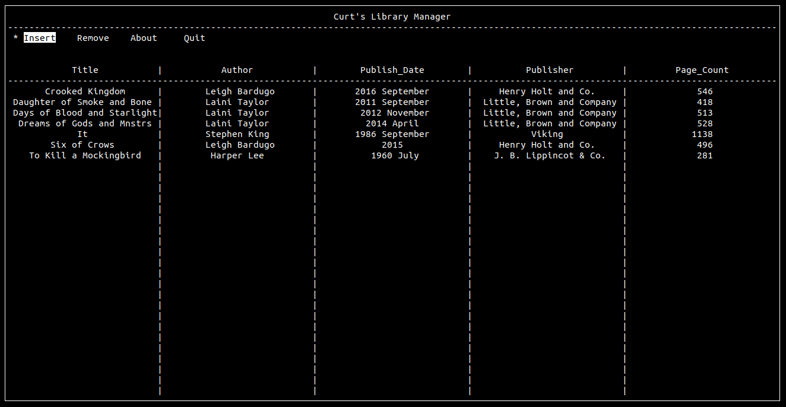

Curt's Library Manager Documentation
================================

Welcome to the documentation for Curt's Library Manager!

Introduction
============

Curt's Library Manager is a project started in 2020 by `Preston Bridgers`_.

.. _preston bridgers: https://www.linkedin.com/in/prestonbridgers

For more detailed documentation please see the `project website`_.

.. _project website: http://www.prestonbridgers.com

Equipment Needed
================

- A linux machine or virtual machine

.. _dl:

Download
========

Dependencies (install these first using your package
manager of choice):

- libncurses
- mySQL server

.. note::

	Package names may change depending on the distribution
	of linux you are running. Currently nCurses, the only
	dependency, is extremely common and widely used. The
	above package name is taken from Debian/Ubuntu/Mint
	repositories.

The project can be cloned from its `github page`_ using the
following command:

``git clone https://www.github.com/prestonbridgers/library-manager.git``

.. _github page: https://github.com/prestonbridgers/library-manager.git

Usage
=====

Compilation
-----------

Keybinds
--------

Navigate the main menu with vim keys.
Press <Enter> to select a menu item.

In the insert window, press tab to navigate the insert fields.
Press <Enter> to insert the fields as a book entry and close the insert window.

To remove an inserted book, type the title of the desired book
into the title field of the remove window and press <Enter>.

FAQs
====

This section will be updated with frequently asked questions from both
users and developers. See the :any:`support` section below
for issues not in this section.

.. _support:

Support
=======

For support of any kind, contact me at:

- prestonbridgers@gmail.com

How to Contribute
=================

Developers feel free to clone the repo and submit a pull request with
changes and additions. Please update the documentation to reflect any
proposed changes. No coding style guidelines are in place as of now.

Licensing
=========

This product is licensed under GNU General Public License version 3.0,
see file LICENSE for more info.
